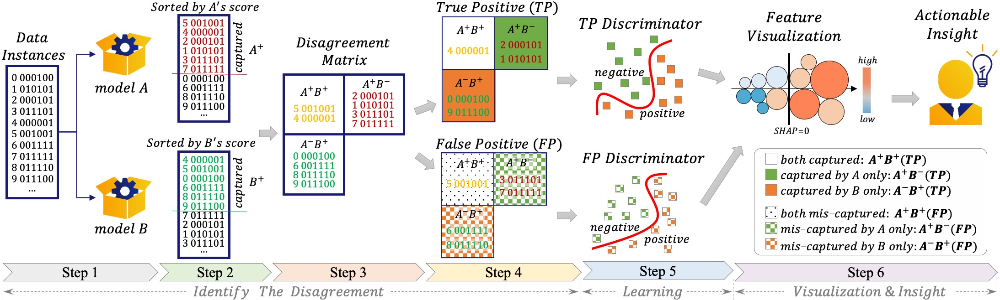

# LFD for Model Comparison

> Learning-From-Disagreement ([LFD]) is a model comparison and visualization framework. It compares two classification models by identifying data instances with disagreed predictions, and learning from the disagreement using a set of proposed meta-features. Based on the SHAP interpretation of the learning process, especially the models' preference on different meta-features, we could interpret the fundamental difference between the two compared models
> 


### LFD Executes in 6 Steps:
_The following explanations use the [Avazu data] (part of day 9 data only) as an example. The two compared classifiers are XGBoost (A) and RNN (B). The details of these two models and their model training features are not required for our comparison (i.e., model-agnostic, feature-agnostic). Please check the details in demo.ipynb_

1. Feed data into the compared classifiers A & B, and get the two classifiers' scores for individual data instances.
    ```sh
    # create an LFD object
    lfd = LFD()
    # give score files of the two models, each file has three columns: "id", "true label", "score"
    lfd.set_A_score('./data/avazu_day_smp_9_xgb.csv')
    lfd.set_B_score('./data/avazu_day_smp_9_rnn.csv')
    ```
2. Sort instances by the two sets of scores decreasingly, and set a threshold as the score cutoff (e.g., 5% of all instances). Instances with scores above it are those captured by individual models (A+ and B+). The threshold often depends on applications, e.g., for loan eligibility predictions, it will be decided by a bank's budget.
    ```sh
    lfd.set_threshold(0.15)
    ```
3. Join the two sets of captured instances from the two models into three cells of the \textit{disagreement matrix}, i.e., A captured B missed (A+B-), A missed B captured (A-B+), and both captured (A+B+). For comparison purposes, the A+B+ instances are of less interest. Also, we do not have A-B- instances, since the filtered instances from Step 2 are at least captured by one model.

4. Based on the true label of the captured instances, we divide the disagreement matrix into two matrices: one for the TP instances (i.e., correctly captured), the other for the FP instances (i.e., mis-captured).
    ```sh
    # Step 3&4 are conducted together to compute the disagreement matrix
    lfd.compute_disagreement_matrix()
    ```
5. Train the TP and FP discriminators (two binary classifiers) to differentiate the A+B+ (negative) and A-B+ (positive) instances from the TP and FP sides, respectively. The training uses a set of meta-features, as the features of model A and B may not be available. 
    ```sh
    # set meta-feature files
    lfd.set_meta_features('./data/avazu_day_9_smp_metafeatures.csv')
    # the "learning" part of LFD, you can learn the TP discriminator or FP discriminator
    lfd.learn('tp')
    ```

6. Visualize/Interpret the discriminators by SHAP to provide insights into the fundamental difference between A and B. The insights also help to rank the meta-features and pick the best ones to ensemble A and B.
    ```sh
    # compute SHAP values for the meta-features
    lfd.compute_shap()
    # visualize the top-30 most differentiable meta-features
    lfd.vis(30)
    ```
   
    

### Features of LFD
- Model-Agnostic Comparison
- Feature-Agnostic Comparison
- Avoiding Data-Imbalance Issues


### LFD Paper
+ [IEEE TVCG link]
+ [ArXiv link]
+ Citation: J. Wang, L. Wang, Y. Zheng, C. -C. M. Yeh, S. Jain and W. Zhang, "Learning-From-Disagreement: A Model Comparison and Visual Analytics Framework," in IEEE Transactions on Visualization and Computer Graphics (TVCG), doi: 10.1109/TVCG.2022.3172107.


### Contact
+ Junpeng Wang (junpenwa@visa.com)
+ Liang Wang (liawang@visa.com)
+ Yan Zheng (yazheng@visa.com)
+ Chin-Chia Michael Yeh (miyeh@visa.com)
+ Shubham Jain (shubhjai@visa.com)
+ Wei Zhang (wzhan@visa.com)


[//]: # (These are reference links used in the body of this note and get stripped out when the markdown processor does its job. There is no need to format nicely because it shouldn't be seen. Thanks SO - http://stackoverflow.com/questions/4823468/store-comments-in-markdown-syntax)
    
   [LFD]: <https://arxiv.org/abs/2201.07849>
   [Avazu data]: <https://zenodo.org/record/2594012#.YQClSVNKjL4>
   [ArXiv link]: <https://arxiv.org/abs/2201.07849>
   [IEEE TVCG link]: <https://ieeexplore.ieee.org/document/9767606>

